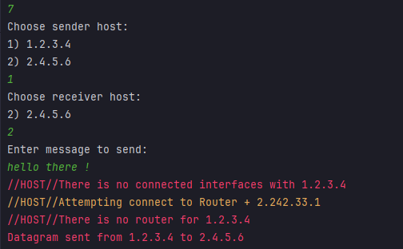
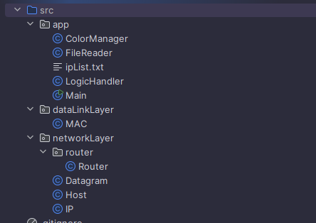

# Network model designed on Java 24

## Description

This is the first version of the OSI standard network model simulation.
The current stack contains only one **network layer**.
The current workspace has a console interface for user interaction.
Also, standard structures for future development (IP type, HOST type, MAC type, etc.) are implemented.
Simple network creation methods are applied.

In the future, it is planned to implement subsequent OSI levels (the operating principle is based on data encapsulation)

## Main Scripts of the Application

